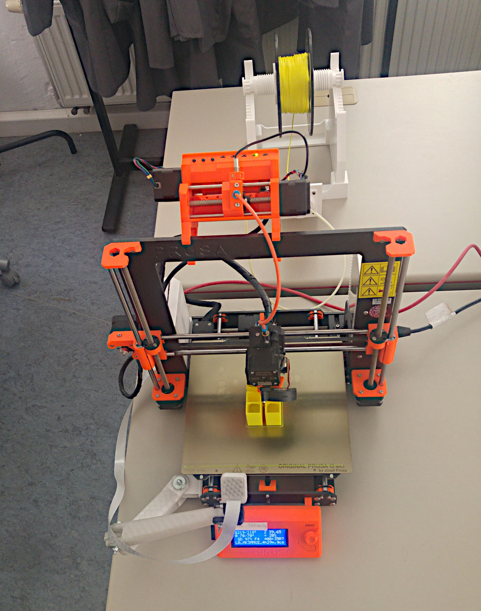
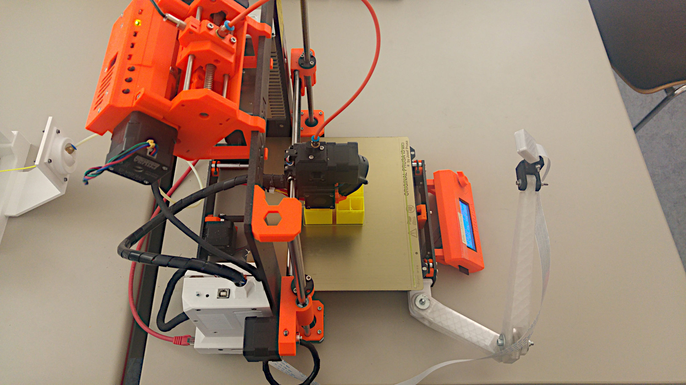
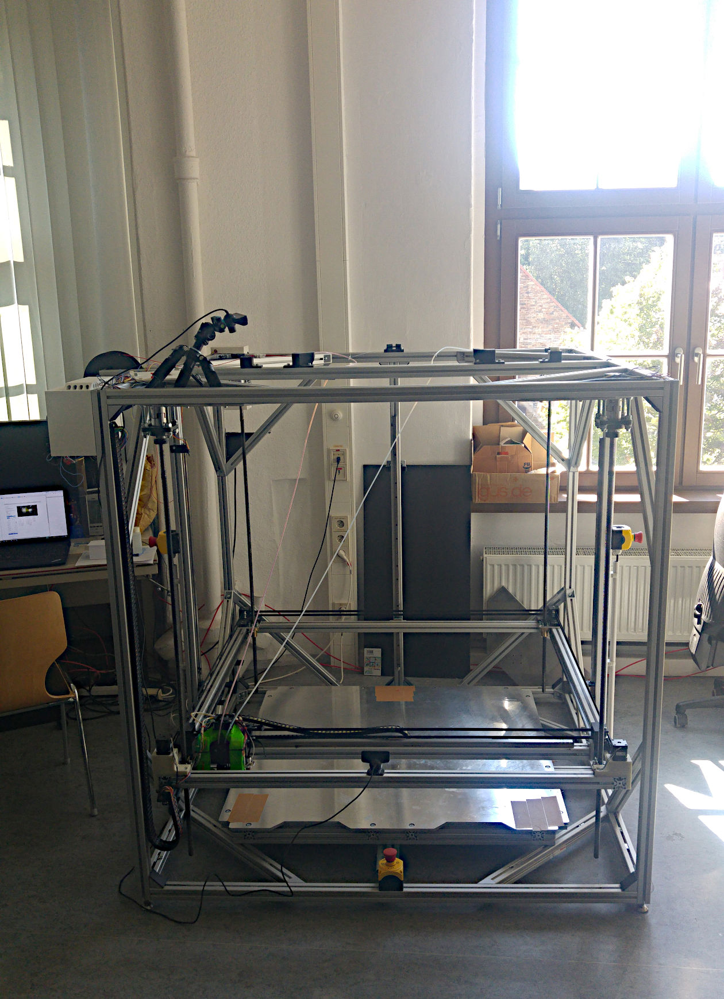
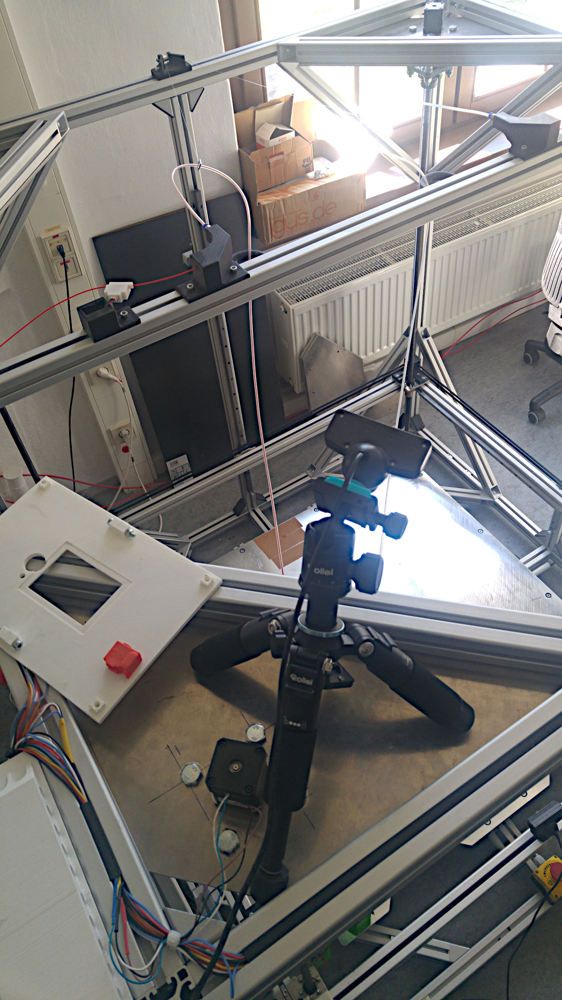
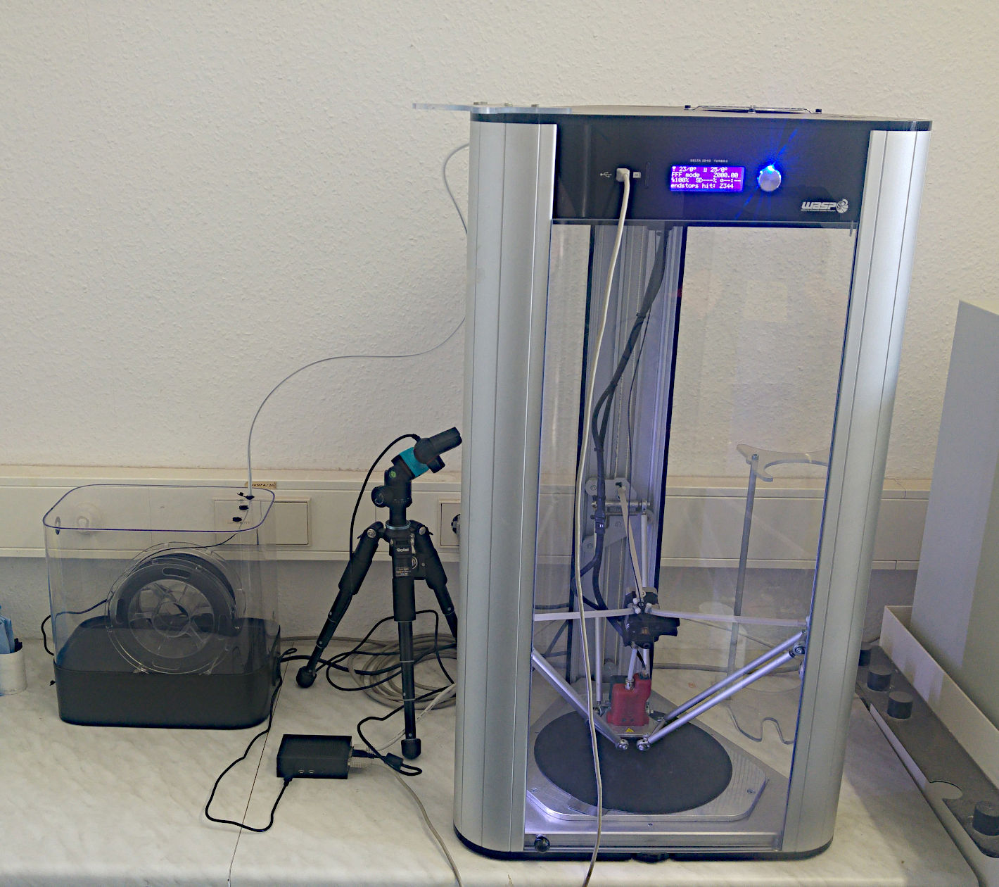
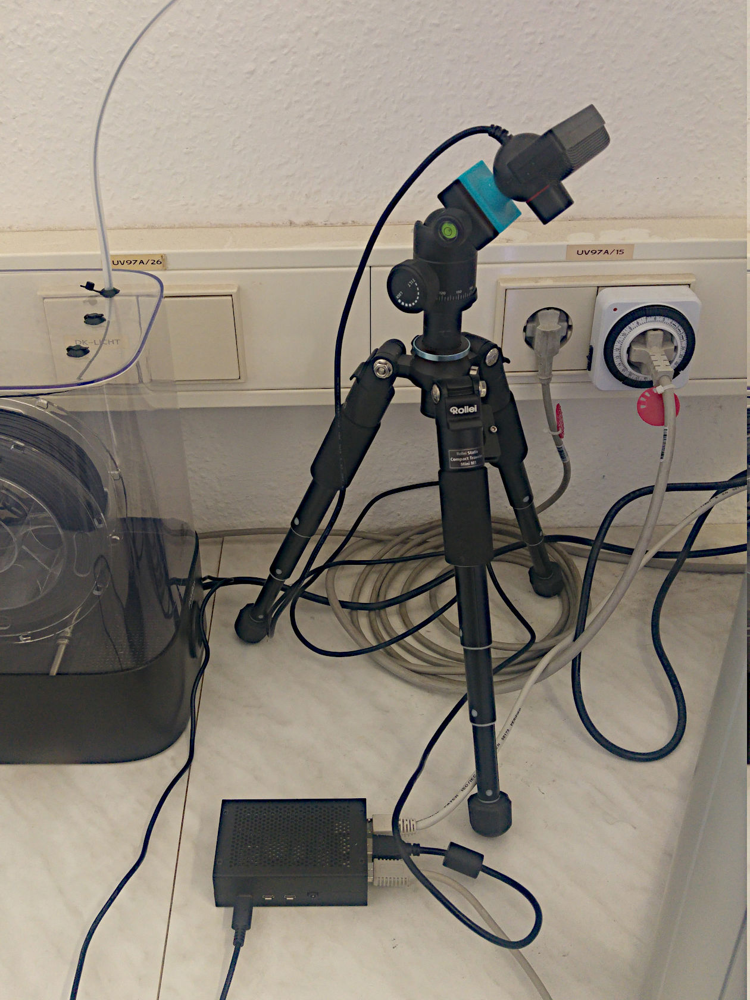

<!--
author:   André Dietrich

email:    Andre.Dietrich@informatik.tu-freiberg.de

version:  0.0.2

language: de

date:     10.10. 2021

narrator: Deutsch Female

comment:  Präsentation zum Vorab-KickOff CrossLabs-Meeting in Freiberg.

logo:     https://technofaq.org/wp-content/uploads/2020/05/kick-off-meetings.png

icon:     pic/Logo_TU_Bergakademie_Freiberg.svg

import:   https://github.com/LiaTemplates/AVR8js/blob/main/README.md
          https://github.com/LiaScript/CodeRunner/blob/master/README.md
-->

# 02 KickOff-Preparation

[qr-code](https://LiaScript.github.io/course/?https://github.com/LiaPlayground/CrossLabs/blob/main/02_KickOff-Preparation.md)


## Agenda


* __09:00 - 10:05__

  - Vorstellung des Ist-Standes
  - Anvisierte Entwicklungen und laufenden Aktivitäten

  | Zeit          | Institution |
  | ------------- | ----------- |
  | 09:05 - 09:20 | Freiberg    |
  | 09:20 - 09:35 | Dortmund    |
  | 09:35 - 09:50 | Ilmenau     |
  | 09:50 - 10:05 | Hamburg     |

* __10:05 - 10:35__

  - Vorbereitung des KickOff-Treffens
  - Diskussion des Zeitplanes

* __10:35 - 11:00__

  - Aktuelle Entwicklungen
  - Netzwerkbildung
  - Öffentlichkeitsarbeit
  - Logo
  - Webseite: https://ifighost.informatik.tu-freiberg.de


## Online Labore Freiberg

                     {{1-2}}
!?[YouTube: eLab in Magdeburg](https://www.youtube.com/watch?v=bICfKRyKTwE&autoplay=1)


                      {{2}}
********************************************************************************

**[LiaScript](https://LiaScript.github.io)**

* Auf Markdown basierende Markup-Sprache für freie Lehrinhalte
* JAMStack (https://en.wikipedia.org/wiki/Jamstack)
* Dezentrale Erstellung von Lehrinhalten
* Clientseitig, _"kein Backend"_
* Beliebig erweiterbar
* Offline-First -> [PWA](https://en.wikipedia.org/wiki/Progressive_web_application)

********************************************************************************


### Rein-Virtuell

             {{1-2}}
<iframe src="https://phet.colorado.edu/sims/html/gas-properties/latest/gas-properties_en.html" style="width: 100%; height: 70vh" scrolling="no" allowfullscreen></iframe>

     {{2}}
??[Simulation: Noninverting Amplifier](https://www.falstad.com/circuit/circuitjs.html?startCircuit=amp-noninvert.txt)

### Teil-Virtuell


   {{1-2}}
``` R
library(ggplot2)

# Use stdout as per normal...
print("Hello, world!")

# Use plots...
png(file="out1.png")
plot(cars)

# Even ggplot!
png(file="out2.png")
qplot(wt, mpg, data = mtcars, colour = factor(cyl))
```
@LIA.eval(`["main.R"]`, `none`, `Rscript main.R`)


   {{2}}
***************************************************************

<div id="example">
<wokwi-led color="red"   pin="13" label="13"></wokwi-led>
<wokwi-led color="green" pin="12" label="12"></wokwi-led>
<wokwi-led color="blue"  pin="11" label="11"></wokwi-led>
<wokwi-led color="blue"  pin="10" label="10"></wokwi-led>
<span id="simulation-time"></span>
</div>

``` cpp
byte leds[] = {13, 12, 11, 10};
void setup() {
  Serial.begin(115200);
  for (byte i = 0; i < sizeof(leds); i++) {
    pinMode(leds[i], OUTPUT);
  }
}

int i = 0;
void loop() {
  Serial.print("LED: ");
  Serial.println(i);
  digitalWrite(leds[i], HIGH);
  delay(250);
  digitalWrite(leds[i], LOW);
  i = (i + 1) % sizeof(leds);
}
```
@AVR8js.sketch(example)

****************************************************************

### Remote

**Maschinenbau**








## Ausblick

* **[Rex Project](https://rexproject.org)**

  - Login & Rechtemanagement
  - Dezentraler Anwendungsentwicklung
  - Einfache API

* **Browser zur Browser Kommunikatikation via**

  - RTCP -> [RealTime Control Protocol](https://en.wikipedia.org/wiki/RTP_Control_Protocol)
  - [Beaker-Browser](https://beakerbrowser.com)

* **LaaS**

  - Integration ala [oEmbed](https://en.wikipedia.org/wiki/OEmbed)
  - [Responsive Design](https://en.wikipedia.org/wiki/Responsive_web_design)
