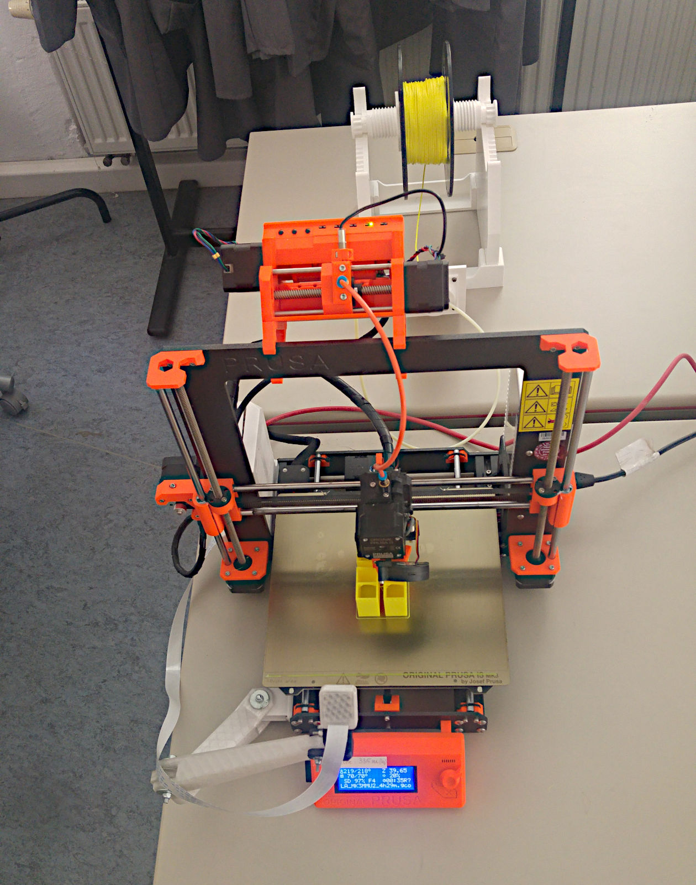
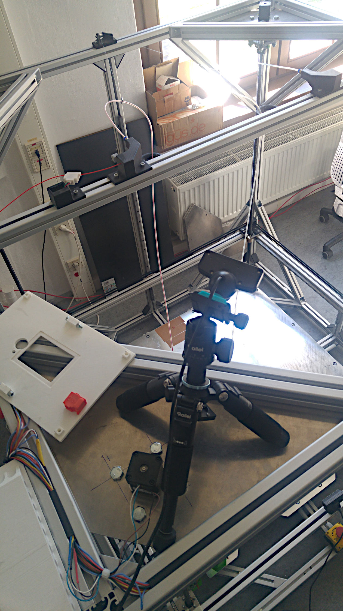

<!--
author:   André Dietrich

email:    Andre.Dietrich@informatik.tu-freiberg.de

version:  0.0.5

language: de

date:     21.10.2021

narrator: Deutsch Female

mode:     Presentation

comment:  Präsentation zum offiziellen KickOff CrossLabs-Meeting in Freiberg.

logo:     https://technofaq.org/wp-content/uploads/2020/05/kick-off-meetings.png

icon:     pic/Logo_TU_Bergakademie_Freiberg.svg

import:   https://github.com/LiaTemplates/AVR8js/blob/main/README.md
          https://github.com/LiaScript/CodeRunner/blob/master/README.md
          import: https://raw.githubusercontent.com/liaTemplates/TextAnalysis/main/README.md
-->

# 03 KickOff-Freiberg

[qr-code](https://LiaScript.github.io/course/?https://github.com/LiaPlayground/CrossLabs/blob/main/03_KickOff.md)


                           --{{0}}--
Herzlich Willkommen zum ersten inoffiziellen Kick-Off vorab Meeting.


                  --{{1 UK English Female}}--
Welcome to the first unofficial kick-off advance meeting.


                  --{{2 Ukrainian Female}}--
Ласкаво просимо на першу неофіційну заздалегідь зустріч.


Kontakt:

| Name               | email                                                                                                  | Institute                        |
| ------------------ | ------------------------------------------------------------------------------------------------------ | -------------------------------- |
| Sebastian Zug      | <a href="mailto:sebastian.zug@informatik.tu-freiberg.de">sebastian.zug@informatik.tu-freiberg.de</a>   | Informatik                       |
| André Dietrich     | <a href="mailto:andre.dietrich@informatik.tu-freiberg.de">andre.dietrich@informatik.tu-freiberg.de</a> | Informatik                       |
| Henning Zeidler    | <a href="mailto:Henning.Zeidler@imkf.tu-freiberg.de">henning.zeidler@imkf.tu-freiberg.de</a>           | Maschinenelemente & Konstruktion |
| Rezo Aliyev        | <a href="mailto:rezo.aliyev@imkf.tu-freiberg.de">rezo.aliyev@imkf.tu-freiberg.de</a>                   | Maschinenelemente & Konstruktion |
| Stefan Krinke      | <a href="mailto:stefan.krinke@imkf.tu-freiberg.de">stefan.krinke@imkf.tu-freiberg.de</a>               | Maschinenelemente & Konstruktion |
| Katja Polanski     | <a href="mailto:Katja.Polanski@iuz.tu-freiberg.de">katja.polanski@iuz.tu-freiberg.de</a>               | Sprachenzentrum                  |
| Mark Jacob         | <a href="mailto:mark.jacob@iuz.tu-freiberg.de">mark.jacob@iuz.tu-freiberg.de</a>                       | Sprachenzentrum                  |
| Martin Bertau      | <a href="mailto:martin.bertau@chemie.tu-freiberg.de">martin.bertaug@chemie.tu-freiberg.de</a>          | Technische Chemie                |
| Ines Aubel         | <a href="mailto:ines.aubel@chemie.tu-freiberg.de">ines.aubelg@chemie.tu-freiberg.de</a>                | Technische Chemie                |
| Sebastian Hippmann | <a href="mailto:sebastian.hippmann@chemie.tu-freiberg.de">sebastian.hippmann@chemie.tu-freiberg.de</a> | Technische Chemie                |


## Online Labore Freiberg

                    --{{0}}--
Die ersten Remote-Lab Erfahrungen haben wir mit dem "industrial eLab" Projekt in
Magdeburg gesammelt. Dabei ging es zunächst nur darum, Studenten online den
Zugriff auf unsere Arduino-Bots zu ermöglichen. Diese solten online über ein
einfaches WebInterface programmiert und gesteuert werden können.  Schnell haben
wir gemerkt, dass ein statisches Interface nicht die benötigte didaktische
Flexibilität bietet, wie wir sie für die Erstellung von Aufgaben für Studentent
mit verschiedenen Schwerpunkten benötigen.


                     {{0-1}}
!?[YouTube: eLab in Magdeburg](https://www.youtube.com/watch?v=bICfKRyKTwE&autoplay=1&start=43)


                    --{{1}}--
Aus diesem Grund haben wir uns entschieden, die Darstellung vom eigentlichen
Interface zu entkoppeln und begonnen eine eigene Auszeichnungsprache zu
entwickeln, die sowohl für Folien, interaktive Bücher, aber auch zur
interaktiven Präsentation genutzt werden können. Auf diese Art und Weise, hoffen
wir, komplexe Aufgaben und Laboranwendungen kleinteilig miteinander verknüpfen
zu können.

                      {{1}}
********************************************************************************

**[LiaScript](https://LiaScript.github.io)**

* Auf Markdown basierende Markup-Sprache für freie Lehrinhalte
* Dezentrale Erstellung von Lehrinhalten
* Clientseitig, _"kein Backend"_
* Beliebig erweiterbar

********************************************************************************


### Rein-Virtuell

                  --{{1}}--
Dies umfasst einerseits rein virtuelle Labore, die nur im Browser beim Anwender
ausgeführt werden und kein "Backend" benötigen.

                   {{1-2}}
??[Fluid simulation1](https://sketchfab.com/3d-models/aqueous-humor-the-eyes-trabecular-meshwork-20-0db7a0cc49ea4a31ac3a7ed94909d6e5)

                   {{2-3}}
??[Fluid simulation](https://haxiomic.github.io/GPU-Fluid-Experiments/html5/)


                   --{{3}}--
Hier als Beispiel ein Textanlyse-Tool, dass mit dem Sprachenzentrum entwickelt
wurde und es erlaubt Texte nach verschiedenen Metriken zu analysieren.

                    {{3-4}}
**********************************************************

``` text Obama, Farewell Speech
On Tuesday, January 10, I’ll go home to Chicago to say my
grateful farewell to you, even if you can’t be there in
person.

I’m just beginning to write my remarks. But I’m thinking
about them as a chance to say thank you for this amazing
journey, to celebrate the ways you’ve changed this country
for the better these past eight years, and to offer some
thoughts on where we all go from here.

Since 2009, we’ve faced our fair share of challenges, and
come through them stronger. That’s because we have never
let go of a belief that has guided us ever since our
founding — our conviction that, together, we can change
this country for the better. So I hope you’ll join me one
last time.
```
@Textanalysis.FULL


``` text Trump, Presidential Bid announcement
Thank you. It’s true, and these are the best and the
finest. When Mexico sends its people, they’re not sending
their best. They’re not sending you. They’re not sending
you. They’re sending people that have lots of problems, and
they’re bringing those problems with us. They’re bringing
drugs. They’re bringing crime. They’re rapists. And some,
I assume, are good people.

But I speak to border guards and they tell us what we’re
getting. And it only makes common sense. It only makes
common sense. They’re sending us not the right people.
```
@Textanalysis.FULL


**********************************************************

                 --{{4}}--
Hier kann man sich vorstellen, dass solche Simulationen auch zur Vorbereitung
für das tatsächliche Remote-Lab genutzt werden und Basiswissen zu vermitteln.


                   {{4}}
??[Simulation: Noninverting Amplifier](https://www.falstad.com/circuit/circuitjs.html?startCircuit=amp-noninvert.txt)


### Teil-Virtuell

             --{{1}}--
Als teil-virtuell bezeichnen wir Anwendungen für einen kleinen Teil oder eine
Berechnung ein externes System (einen Server) benötigen. Die Darstellung und
Interpretation von Daten erfolgt dann wiederum im Browser.


   {{1-2}}
``` R
library(ggplot2)

# Use stdout as per normal...
print("Hello, world!")

# Use plots...
png(file="out1.png")
plot(cars)

# Even ggplot!
png(file="out2.png")
qplot(wt, mpg, data = mtcars, colour = factor(cyl))
```
@LIA.eval(`["main.R"]`, `none`, `Rscript main.R`)

               --{{2}}--
Im folgenden Beispiel wird der Programmcode an einen externen Server gesandt,
der diesen kompiliert und den erzeugten Bytecode oder die entsprechenden
Fehlermeldungen zurück an den Nutzer sendet. Dieser Bytecode wird dann in einer
konfigurierbaren Arduino-Simulation im Browser ausgeführt.


   {{2}}
***************************************************************

<div id="example">
  <wokwi-pushbutton color="green" pin="2" ></wokwi-pushbutton>
  <wokwi-led        color="green" pin="11"></wokwi-led>
  <wokwi-led        color="blue"  pin="12"></wokwi-led>
  <wokwi-led        color="red"   pin="13"></wokwi-led>
  <wokwi-pushbutton color="red"   pin="3" ></wokwi-pushbutton>
</div>

``` cpp
void setup() {
  Serial.begin(115200);
  pinMode(2, INPUT_PULLUP);
  pinMode(3, INPUT_PULLUP);
  pinMode(11, OUTPUT);
  pinMode(12, OUTPUT);
  pinMode(13, OUTPUT);
}

int i = 0;
void loop() {
  bool green = digitalRead(2);
  bool red   = digitalRead(3);
  Serial.print("LED: ");
  Serial.println(i);

  digitalWrite(11, green);
  digitalWrite(13, red);
  delay(250);

  i += 1;

  digitalWrite(12, i % 2);
}
```
@AVR8js.sketch(example)

****************************************************************

### Remote


                      {{1-2}}
********************************************************************************

**Technische Chemie:** Rektifikation/Flüssig-Extraktion

                    --{{1}}--
Als reine Remote-Labore nutzen, wir in der technischen Chemie zur Vermittlung
der Grundlagen von thermischen und mechanischen Grundoperationen zwei
praxisnahen, industriellen Beispielen (Rektifikation,
Flüssig/Flüssig-Extraktion)


********************************************************************************

                     {{2}}
********************************************************************************

**Additive Fertigung:** 3D-Druck

                   --{{2}}--
Drei Drucker unterschiedlicher Größe zur Herstellung einfacher bis komplexer
Teile vermitteln ein besseres Verständnissen für die offene Bauteilgestaltung.
Die 3D-Modelle werden von den Studenten am eigenen Rechner entworfen und auf den
Server hochgeladen. Der Bauprozesses wird über einen Live-Stream überwacht
und Parameteranpassungen sind während des gesamten Prozesses möglich.







********************************************************************************

## Ausblick

                        --{{1}}--
Wie kann lassen sich nun verschiedene Remote-Lab Ansätze miteinander
kombinieren? Vielleicht durch das Cross-Lab im Browser, als konfigurierbare
Instanz, sodass Daten beim Nutzer zusammengeführt und koordiniert an die
verbundenen Labore übermittelt werden.


                       {{1-2}}
``` ascii
                              .------------------------.
                              |  Teilvirtuelle Labore  |
                              '------------------------'
                                          ^
                                          |
                                          |
                                          v
.------------------.          +-----------------------+           .------------------------.
| Virtuelle Labore |<-------->|       Cross-Lab       |<--------->|      Remote Labore     |
'------------------'          +-----------------------+           '------------------------'
                                          ^
                                          |
                                          |
                                          v

                                      😊  User
```

                     --{{2}}--
Des Weiteren sehen wir derzeit vor Allem zwei Baustellen. Reine Remote-Labore
und teilweise virtuelle, benötigen zumeist ein komplexes Nutzer und
Rechtemanagement, wer darf wann auf welche Resource zugreifen. Um dies möglichst
einfach und ganzheitlich zu realisieren würden wir gerne mit den Team von
Rex-Project kooperieren, die viele solcher Management-Aufgaben bereits durch ein
eigenens Framework lösen.

                      {{2}}
1. __[Rex Project](https://rexproject.org)__

   - Login & Rechtemanagement
   - Dezentraler Anwendungsentwicklung


                   --{{3}}--
Unter dem Stichwort Labs as a Service stellen wir uns je Labor einen einfachen
Dienst vielleicht auch Web-Komponente vor mit einer standardisierten minimalen
API, die für den Nutzer, basierend auf der Aufgaben, seinen Rechten und des ihm
zur Verfügung stehenden Displays ein optimales Interface zurückliefert, das in
verschiedene Webseiten, LMS und auch LiaScript-Kurse eingefügt werden kann.

                      {{3}}
2. __LaaS__

   - Integration ala [oEmbed](https://en.wikipedia.org/wiki/OEmbed)
   - [Responsive Design](https://en.wikipedia.org/wiki/Responsive_web_design)
